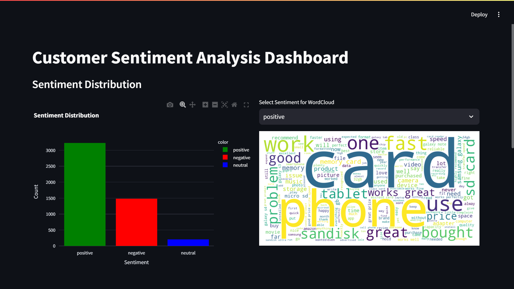
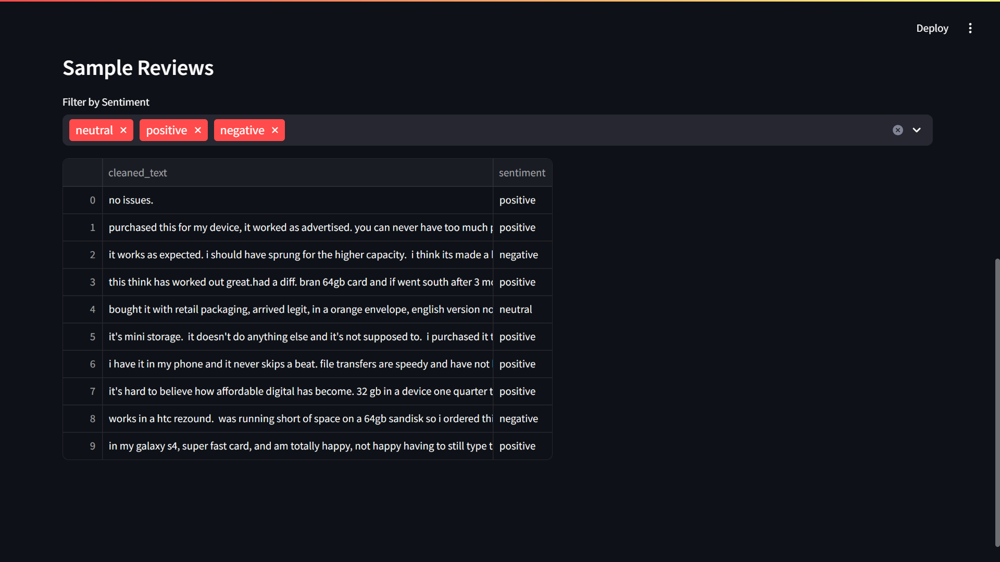

# AI-Powered Customer Sentiment Analytics with Hugging Face

This project provides an **AI-powered solution for customer sentiment analysis** using **Hugging Face Transformers**. Customer reviews are analyzed for sentiment (Positive, Neutral, Negative) and visualized using an **interactive Streamlit dashboard**. This project is designed to empower businesses to gain insights from customer feedback and enhance customer satisfaction.

---

## Features

- **Data Preprocessing**:
  - Cleans and processes raw customer reviews using **NLTK**.
- **Sentiment Analysis**:
  - Uses pre-trained Hugging Face models (e.g., `distilbert-base-uncased`) for sentiment classification.
- **Interactive Dashboard**:
  - Visualizes sentiment distribution and word clouds with **Streamlit**.
- **Word Clouds**:
  - Highlights frequently used words in customer reviews.
- **Progress Tracking**:
  - Displays real-time progress using **TQDM**.

---


---

## Technologies Used

- **Python**: Core programming language for building the project.
- **Hugging Face Transformers**: For leveraging pre-trained NLP models (e.g., DistilBERT).
- **NLTK**: For natural language preprocessing.
- **Streamlit**: For an interactive, web-based dashboard.
- **Pandas**: For dataset handling and processing.
- **Plotly & Matplotlib**: For creating interactive and static visualizations.
- **WordCloud**: To generate word clouds for review insights.
- **TQDM**: For monitoring progress during sentiment analysis.

---

## Setup and Usage

### 1. Clone the Repository
Clone the repository to your local machine:
```bash
git clone https://github.com/AvishalYadav/Sentiment-Analysis.git
cd Sentiment-Analysis
```

### 2. Install Dependencies

```bash
pip install -r requirements.txt
```

### 3. Preprocess the Dataset

```bash
python src/preprocess.py
```

### 4. Perform Sentiment Analysis

```bash
python src/sentiment_analysis.py
```

### 5. Run the Streamlit App

```bash
streamlit run src/app.py
```

## Expected Outputs
### Dashboard Features
- Sentiment Distribution:
  - A bar chart showing the count of Positive, Neutral, and Negative reviews.
- Word Cloud:
  - Displays the most frequently used words in reviews.
- Sample Sentiments:
  - Displays a table of sample customer reviews with their sentiment classifications.

  

  

## Contact
    For questions or feedback, feel free to reach out:
    Your Name: Vishal Yadav
    GitHub Profile: (https://github.com/AvishalYadav)
